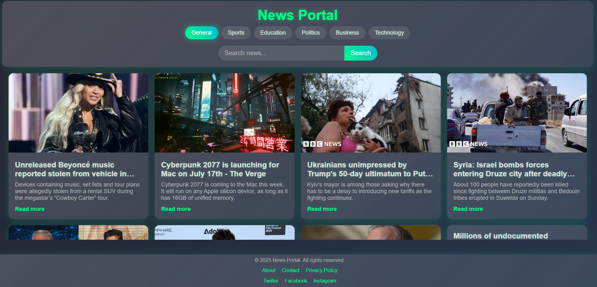
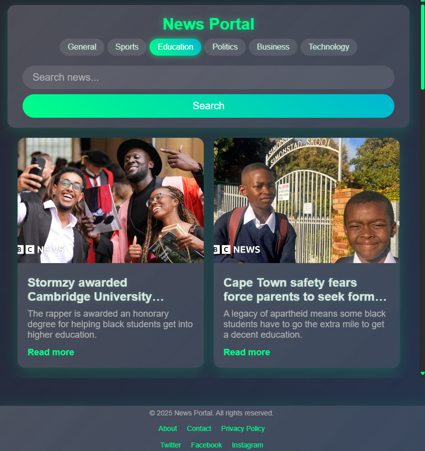

# <p align=center>News Portal </p>


***

A responsive single-page web application that allows users to browse and search for news articles using the [News API](https://newsapi.org/). Users can select popular news categories or enter custom search queries, and navigate through pages of results with pagination support.

***



***

## Features

- Browse news by categories: General, Sports, Education, Politics, Business, Technology.
- Search news articles by keywords.
- View article title, description, source and thumbnail image.
- Pagination to navigate through multiple pages of news results.
- Responsive and user-friendly interface.
- Footer with links and social media placeholders.

***

## Installation

1. Clone this repository:
   ```
   git clone https://github.com/888i888/API-week3-Project-NEWS-PORTAL.git
   ```
2. Open `index.html` in your browser.

***

## API Key Setup

This project uses the News API. You need to get your own API key:

1. Sign up at [https://newsapi.org/](https://newsapi.org/).
2. Replace the `API_KEY` value in `js/api.js` with your API key.

```js
const API_KEY = 'YOUR_API_KEY_HERE';
```
***

## Project Structure

```
News Portal
│
├── index.html                      # Main HTML entry point
│
├── css/
│   └── styles.css                  # Styles for layout, news cards, and UI components
│
├── js/
│   ├── api.js                      # Handles API requests and news data fetching
│   ├── config.js                   # Stores constants like API key and base URL
│   ├── events.js                   # Attaches UI event listeners (search, nav, input)
│   ├── layout.js                   # Dynamically creates and appends HTML layout
│   ├── main.js                     # Application entry point; wires everything together
│   ├── pagination.js               # Controls pagination UI and page changes
│   ├── scrollHandler.js            # Manages header visibility on scroll
│   ├── state.js                    # Maintains global state (current page, query, etc.)
│   ├── newsRenderer.js             # Renders fetched news articles into the DOM
│   ├── pagination.js               # Controls pagination UI and page changes
│   ├── scrollHandler.js            # Manages header visibility on scroll
│   ├── state.js                    # Maintains global state (current page, query, etc.)
│
├── assets/
│   └── favicon.ico                 # Site favicon
│
└── README.md                       # Project description and setup instructions


```
***

## Technologies Used

- HTML
- CSS
- JavaScript
- News API 

***
